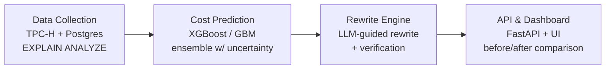

# DB Query Cost Predictor

Predicting SQL query execution cost before runtime — and automatically generating verified, cheaper query rewrites.

---

## Overview

When a SQL query runs against a database, there is usually no reliable way to know in advance how expensive it will be — whether that means slow execution time, heavy CPU/memory consumption, or, in usage-billed cloud data warehouses, a real dollar cost. Databases estimate cost internally through their query optimizer, but this estimate relies on static heuristics and statistical assumptions that frequently break down on complex, real-world workloads.

**DB Query Cost Predictor** addresses this in two stages:

1. **Prediction** — a machine learning model trained on real, measured query execution data predicts a query's cost and flags it as high-risk before it ever runs.
2. **Remediation** — for any query flagged as high-risk, an LLM-guided rewrite engine generates an alternative query, grounded in the query's actual schema and execution plan, and verifies it is genuinely cheaper before surfacing it.

Most existing tools and research in this space stop at prediction. This project treats prediction as only half the problem.

---

## Architecture



Each stage's output feeds directly into the next.

---

## Repository Structure

```text
db-query-cost-predictor/
    data_collection/   # TPC-H setup, query generation, EXPLAIN ANALYZE collection scripts
    cost_model/        # Feature extraction, model training, evaluation
    rewrite_engine/     # LLM-based rewrite generation and verification
    api/                # Prediction + rewrite API
    dashboard/          # Demo UI - cost prediction and rewrite comparison view
    notebooks/          # Exploratory analysis and evaluation notebooks
    docs/               # Design docs, research notes, evaluation reports
    README.md
```

---

## Tech Stack

| Component | Tools |
|---|---|
| Database & benchmark | PostgreSQL, TPC-H |
| Cost prediction | Python, XGBoost / LightGBM, scikit-learn |
| Query rewriting | LLM API integration, SQL parsing/validation |
| Backend | Python (FastAPI) |
| Dashboard | TBD |

---

## Getting Started

### Prerequisites
- PostgreSQL (local or Docker)
- Python 3.10+
- [TPC-H toolkit](https://github.com/gregrahn/tpch-kit) for benchmark data and query generation

### Setup

```bash
# Clone the repository
git clone https://github.com/db-query-cost-predictor/db-query-cost-predictor.git
cd db-query-cost-predictor

# Create a virtual environment
python -m venv .venv
source .venv/bin/activate

# Install dependencies
pip install -r requirements.txt
```

Detailed setup for each pipeline stage is documented in its respective folder.

---

## Methodology

This project is grounded in current research on learned cost models and query optimization, including work on resource-aware cost prediction, production-scale execution time prediction, and systematic evaluation of learned cost models against traditional query optimizers. Full references and the research gap this project addresses are documented in `docs/`.

The evaluation approach goes beyond raw prediction accuracy: the system is assessed on whether its predictions and rewrites lead to measurably better real-world outcomes, not just lower prediction error.

---

## Status

Actively in development. See `docs/` for current progress and evaluation results.

---

## License

MIT
