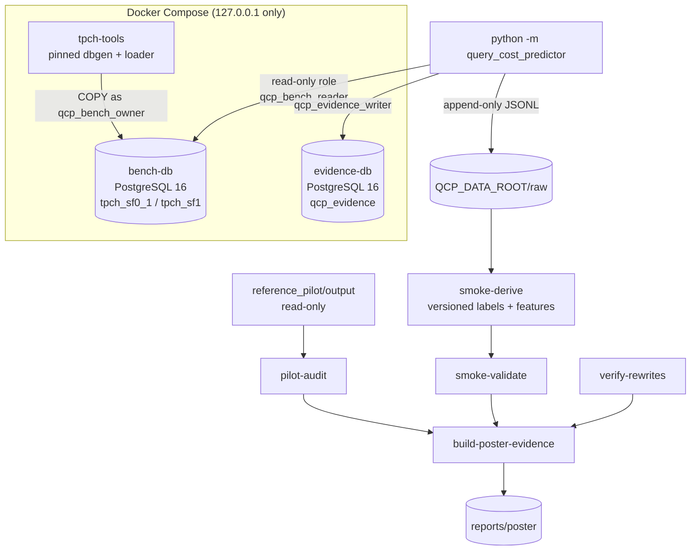

# Architecture

Status legend: **implemented (poster milestone, unexecuted)** · **planned** ·
**not yet evaluable**. Nothing here has been run by its author.

## 1. Complete intended pipeline

```mermaid
flowchart LR
    A[SQL text + schema] --> B[Plain EXPLAIN<br/>class D estimates]
    B --> C[Pre-execution feature builder<br/>classes A-D only]
    C --> D[Runtime-distribution model<br/>+ high-runtime classifier]
    D --> E[Calibrated, uncertainty-aware<br/>warning gate]
    E --> F[LLM candidate generation]
    F --> G[Semantic-equivalence verification]
    G --> H[Paired performance benchmark]
    H --> I[Recommend only verified,<br/>faster rewrites]
```



| Stage | Poster milestone | Final study |
|---|---|---|
| SQL + schema, safety validation | implemented (`safety.py`) | reused |
| Plain `EXPLAIN` estimate capture | implemented (collector) | reused |
| Feature builder (A–D) + availability contract | implemented (`contract.py`, `plans.py`, `sqltext.py`) | extended (B-class catalog statistics) |
| Runtime-distribution model | pilot diagnostic only (`pilot_audit.py`) | planned |
| High-runtime classifier | not evaluable (no positives) | planned |
| Calibrated uncertainty-aware gate | — | planned |
| LLM candidate generation | — | planned (RQ2) |
| Equivalence verification | implemented for manual reference pairs (`rewrite_verify.py`) | extended to LLM candidates |
| Paired performance benchmark | implemented for manual pairs | reused |
| Recommend only verified faster rewrites | implemented decision rule | reused |

## 2. Poster-milestone components



* **bench-db** runs only benchmark queries. Evidence writes go to
  **evidence-db** so they never share the measured server's WAL, checkpoints or
  buffers.
* **Raw evidence first:** every record is flushed and fsynced to a new
  session JSONL file, then inserted into the evidence database. On resume, raw
  files are re-verified and reconciled; the database must match them exactly.
* **Derived evidence** (labels, features, releases) is versioned and rebuilt
  from raw files; a rebuild of unchanged inputs must be byte-identical.

### Roles and safety

| Role | Used by | Rights |
|---|---|---|
| container admin | `db-init` only | superuser inside the container |
| `qcp_bench_owner` | TPC-H loader | owns benchmark databases |
| `qcp_bench_reader` | every measured query, the rewrite harness | not superuser; `SELECT` only; `default_transaction_read_only = on`; `temp_file_limit`; no `TEMP`/`CREATE` |
| `qcp_evidence_owner` | migrations | owns the evidence schema |
| `qcp_evidence_writer` | collector, derive, validate | `INSERT`/`SELECT`; `UPDATE`/`DELETE` only on derived tables; raw tables have append-only triggers |

Every measured statement: validated as a single read-only `SELECT`/`WITH …
SELECT` → `BEGIN READ ONLY` → `set_config` for statement timeout, lock timeout
and configuration settings → execute → **always rolled back**. A client
watchdog cancels statements that outlive the server timeout.

## 3. Planned final model comparison (not implemented)

| Model | Role |
|---|---|
| Global median | sanity baseline |
| Raw PostgreSQL estimated cost | rank baseline (planner units) |
| Calibrated PostgreSQL cost (log-linear, fitted in each training fold) | native baseline to beat |
| Elastic Net on log runtime | interpretable linear baseline |
| XGBoost or CatBoost regression | primary regression candidate |
| XGBoost or CatBoost high-runtime classification | primary warning model |
| Timeout-aware XGBoost AFT (`survival:aft`, censored intervals) | uses right-censored keys correctly |
| QueryFormer or another plan-tree model | later, data-gated challenger only |

All preprocessing (encoders, scalers, calibration) is fitted inside each
training fold. Template, semantic-group and query identifiers are never features.

## 4. Evaluation design (planned)

* **Primary split:** hold out unseen structural/semantic groups (grouped
  cross-validation by `semantic_group_id`/template), with keys, groups and keys
  per group reported next to every result.
* **Additional holdouts:** AST/literal-insensitive fingerprint, workload, scale,
  configuration and the five reserved anti-pattern families.
* **Random split:** leakage diagnostic only; never presented as unseen-structure performance.
* **Regression metrics:** log-runtime MAE, median / p90 / p95 q-error, MAE and
  RMSE in ms; R² secondary and never called accuracy.
* **High-runtime classification metrics:** PR-AUC as the primary ranking metric;
  recall and false-negative rate as primary safety measures; precision and
  warnings per 100 queries; Brier score and calibration curve; ROC-AUC
  secondary; raw accuracy is never a headline metric.

## 5. RQ2 denominator (planned)

```
generated → executable → verification attempted → verified equivalent → faster → recommended
```

Every stage is reported with counts from the full denominator of attempts,
including failures and slowdowns. See [rq2_verification_protocol.md](rq2_verification_protocol.md).

## 6. Code map

| Module | Purpose |
|---|---|
| `cli.py` | command entry point (`python -m query_cost_predictor …`) |
| `config.py`, `envfile.py`, `paths.py` | typed configuration, `.env`, path rules |
| `safety.py`, `sqltext.py` | read-only statement validator, SQL lexer and A-class features |
| `plans.py` | plan parsing: estimate view (D) vs execution metrics (E) |
| `contract.py` | availability registry enforcement |
| `hashing.py` | canonical JSON, identities (`query_instance_id`, `modeling_key`) |
| `labels.py`, `metrics.py`, `splits.py` | labels with censoring, metrics, deterministic folds |
| `pilot_audit.py` | independent pilot audit |
| `db.py`, `dbinit.py`, `snapshot.py` | connections, roles/migrations, snapshot identity |
| `smoke_manifest.py`, `executor.py`, `evidence.py`, `evidence_store.py`, `smoke_collector.py` | manifest, execution primitives, raw evidence, database writes, collector |
| `smoke_derive.py`, `smoke_validate.py` | rebuildable labels/features, validation |
| `rewrite_verify.py` | manual reference-rewrite harness |
| `claims.py`, `reporting/*` | claim rendering/linting, loaders, figures, builder, notebook helpers |
| `final_plan.py` | planned final-study arithmetic (`PLANNED`) |
